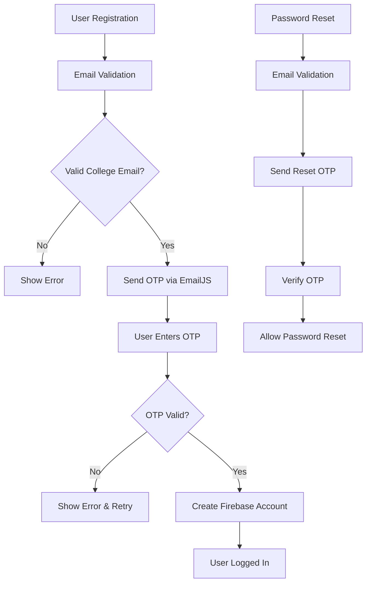

# Campus Keeper 🏫

<div align="center">
  <h3>Lost & Found Portal for Graphic Era University</h3>
  <p>A comprehensive web application designed to streamline the process of reporting and recovering lost items within the Graphic Era campus community.</p>
  
  [](https://reactjs.org/)
  [](https://firebase.google.com/)
  [](https://tailwindcss.com/)
  [](LICENSE)
</div>

---

## 📋 Table of Contents

- [Overview](#overview)
- [Features](#features)
- [Demo](#demo)
- [Tech Stack](#tech-stack)
- [Getting Started](#getting-started)
- [Project Structure](#project-structure)
- [Authentication Flow](#authentication-flow)
- [Contributing](#contributing)
- [License](#license)
- [Contact](#contact)

## 🎯 Overview

Campus Keeper addresses the common problem of lost items on university campuses by providing a centralized platform where students can report lost items, post found items, and connect with each other to facilitate returns. The application ensures security by restricting access to verified college email addresses only.

### 🎓 Target Audience
- Students of Graphic Era Deemed to be University, Dehradun
- GEHU Dehradun, Haldwani, and Bhimtal campuses
- Faculty and staff with valid college email IDs

## ✨ Features

### 🔐 Secure Authentication
- **College Email Verification**: Only `@geu.ac.in` and `@gehu.ac.in` email addresses accepted
- **OTP-based Verification**: 4-digit OTP sent via EmailJS for enhanced security
- **Password Recovery**: Secure password reset using OTP verification
- **Session Management**: Persistent login with Firebase Authentication

### 👤 User Profile Management
- **Personal Information**: Update name, course, section, phone number
- **Campus Details**: College and campus information
- **Activity Tracking**: View all posted items in one place
- **Profile Customization**: Manage personal details and preferences

### 📦 Item Management
- **Post Lost Items**: Report lost items with detailed descriptions
- **Post Found Items**: Help others by posting found items
- **Rich Media Support**: Upload images to help identify items
- **Location Tracking**: Specify where items were lost or found
- **Categorization**: Clear tagging system for lost/found items

### 🔍 Advanced Search & Discovery
- **Real-time Search**: Case-insensitive search across item titles
- **Keyword Highlighting**: Visual emphasis on search matches
- **Smart Sorting**: Items sorted by newest first for relevance
- **Detailed View**: Comprehensive item details with contact information

### 🛠️ Administrative Features
- **Bulk Operations**: Delete multiple items at once
- **Confirmation Modals**: Prevent accidental deletions
- **Data Management**: Efficient storage and retrieval via Firebase

## 🎥 Demo

*[Add screenshots or GIF demonstrations of key features here]*

## 🚀 Tech Stack

### Frontend
- **React 18.x** - Modern React with functional components and hooks
- **React Router v6** - Client-side routing and navigation
- **Tailwind CSS** - Utility-first CSS framework for responsive design

### Backend & Services
- **Firebase Authentication** - Secure user authentication
- **Firebase Firestore** - NoSQL database for real-time data
- **Firebase Storage** - Cloud storage for images
- **EmailJS** - Email service for OTP delivery

### Development Tools
- **Vite** - Fast build tool and development server
- **ESLint** - Code linting and style enforcement
- **Git** - Version control

## 🏗️ Getting Started

### Prerequisites
- Node.js (v16 or higher)
- npm or yarn package manager
- Firebase account
- EmailJS account

### Installation

1. **Clone the repository**
   ```bash
   git clone https://github.com/your-username/campus-keeper.git
   cd campus-keeper
   ```

2. **Install dependencies**
   ```bash
   npm install
   ```

3. **Configure environment variables**
   
   Create a `.env` file in the root directory:
   ```env
   # Firebase Configuration
   REACT_APP_FIREBASE_API_KEY=your_api_key
   REACT_APP_FIREBASE_AUTH_DOMAIN=your_auth_domain
   REACT_APP_FIREBASE_PROJECT_ID=your_project_id
   REACT_APP_FIREBASE_STORAGE_BUCKET=your_storage_bucket
   REACT_APP_FIREBASE_MESSAGING_SENDER_ID=your_messaging_sender_id
   REACT_APP_FIREBASE_APP_ID=your_app_id
   
   # EmailJS Configuration
   REACT_APP_EMAILJS_SERVICE_ID=your_service_id
   REACT_APP_EMAILJS_TEMPLATE_ID=your_template_id
   REACT_APP_EMAILJS_PUBLIC_KEY=your_public_key
   ```

4. **Start the development server**
   ```bash
   npm run dev
   ```

5. **Open your browser**
   Navigate to `http://localhost:3000`

### Firebase Setup

1. Create a new Firebase project at [Firebase Console](https://console.firebase.google.com/)
2. Enable Authentication with Email/Password provider
3. Create a Firestore database
4. Set up Firebase Storage
5. Copy the configuration keys to your `.env` file

### EmailJS Setup

1. Create an account at [EmailJS](https://www.emailjs.com/)
2. Create an email service and template for OTP delivery
3. Add the service ID, template ID, and public key to your `.env` file

## 📁 Project Structure

```
src/
├── assets/                 # Static files and images
├── components/             # Reusable UI components
│   ├── common/            # Shared components (Header, Footer, etc.)
│   ├── forms/             # Form components
│   └── ui/                # UI elements (buttons, modals, etc.)
├── contexts/              # React Context providers
│   └── AuthContext.js     # Authentication context
├── pages/                 # Page components
│   ├── Home.js           # Landing page
│   ├── Profile.js        # User profile page
│   ├── PostItem.js       # Item posting page
│   └── ViewItems.js      # Items listing page
├── services/              # External service integrations
│   ├── firebase.js       # Firebase configuration
│   └── emailjs.js        # EmailJS service
├── utils/                 # Utility functions
│   ├── validators.js     # Input validation
│   └── helpers.js        # Helper functions
├── App.js                # Main application component
└── index.js              # Application entry point
```

## 🔐 Authentication Flow



## 🤝 Contributing

We welcome contributions from the community! Please follow these steps:

1. **Fork the repository**
2. **Create a feature branch**
   ```bash
   git checkout -b feature/your-feature-name
   ```
3. **Make your changes**
4. **Commit your changes**
   ```bash
   git commit -m "Add: your feature description"
   ```
5. **Push to your branch**
   ```bash
   git push origin feature/your-feature-name
   ```
6. **Create a Pull Request**

### Code Style Guidelines
- Use functional components with hooks
- Follow ESLint configuration
- Write descriptive commit messages
- Add comments for complex logic
- Ensure responsive design with Tailwind CSS

## 📝 License

This project is licensed under the MIT License - see the [LICENSE](LICENSE) file for details.

## 📞 Contact

**Project Maintainer**: [Your Name]
- Email: your.email@example.com
- GitHub: [@your-username](https://github.com/your-username)
- LinkedIn: [Your Profile](https://linkedin.com/in/your-profile)

**Institution**: Graphic Era Deemed to be University, Dehradun

---

<div align="center">
  <p>Made with ❤️ for the Graphic Era community</p>
  <p>If you found this project helpful, please consider giving it a ⭐</p>
</div>
